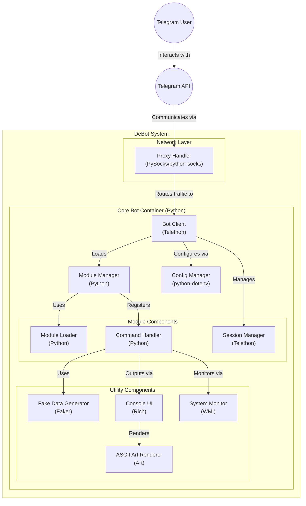

# DeBot | Лучший модульный userbot для Telegram




## Установка:
```sh
git clone https://github.com/DeBotCommunity/DeBot.git
cd DeBot
pip3 instal -r requirements.txt
```

## Запуск

### Описание параметров
- `-s`: Название файла сессии. Тип аргумента: строка. Значение по умолчанию: account
- `-p`: Настройки прокси. Параметр принимает 5 значений: Тип Прокси, IP, Порт, Имя пользователя и Пароль. Тип значения: список строк (nargs=5). Полная поддержка HTTP/S, SOCKS4, SOCKS5

## Примеры запуска: 
1. **Запуск с параметром пути к сессии:**
   ```sh
   python3 -m userbot -s "путь_к_сессии"
   ```
2. **Запуск с параметрами прокси:**
   ```sh
   python3 -m userbot -p "Тип_Прокси" "IP" "Порт" "Имя_пользователя" "Пароль"
   ```
3. **Запуск с обоими параметрами:**
   ```sh
   python3 -m userbot -s "путь_к_сессии" -p "Тип_Прокси" "IP" "Порт" "Имя_пользователя" "Пароль"
   ```

## Стоковые команды:
- `.addmod` - добавление модуля. Отправляется реплаем на файл с модулем, зависимости модуля обнаруживаются и устанавливаются автоматически.
- `.delmod <имя модуля>` - удаление модуля.
- `.help` - справка.
- `.about` - о юзерботе.

## Telegram Канал: [DeBot | Main](https://t.me/DeBot_userbot)
Предложить модуль в канал или задонатить: [@whynothacked](https://t.me/whynothacked)
