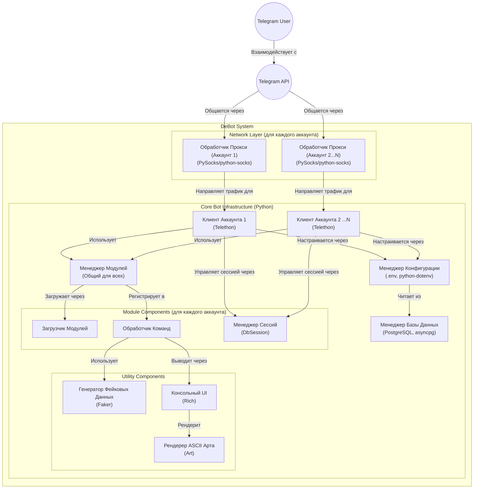

# DeBot | Лучший модульный userbot для Telegram


DeBot - это мощный и гибкий модульный пользовательский бот для Telegram, разработанный на Python с использованием библиотеки Telethon. Он поддерживает запуск нескольких аккаунтов одновременно, каждый со своими индивидуальными настройками прокси и модулей.



## Установка:
```sh
git clone https://github.com/DeBotCommunity/DeBot.git
cd DeBot
pip3 install -r requirements.txt
```
Перед первым запуском убедитесь, что у вас настроена база данных PostgreSQL и создан файл `.env` с необходимыми учетными данными для подключения к БД (см. `config.py` для списка переменных окружения, таких как `DB_USER`, `DB_PASS`, `DB_NAME`, `DB_HOST`, `DB_PORT`). Также необходимо указать `USERBOT_ENCRYPTION_KEY` для шифрования чувствительных данных.

## Настройка и Управление Аккаунтами

### Создание первого аккаунта
1.  **API Ключи Telegram:** Убедитесь, что в вашем файле `.env` присутствуют переменные `API_ID` и `API_HASH`. Вы можете получить их с [my.telegram.org](https://my.telegram.org). Эти глобальные ключи будут использованы для добавления вашего первого аккаунта, если они не указаны для конкретного аккаунта при других способах добавления.
2.  **Запуск `preinstall.py`:** Для интерактивного добавления первого аккаунта в базу данных (или если вы хотите добавить аккаунт с запросом данных через консоль), запустите скрипт:
    ```sh
    python3 -m userbot.src.preinstall
    ```
    Скрипт запросит у вас имя аккаунта (для идентификации в системе). Если `API_ID` и `API_HASH` не найдены в `.env` (или если вы решите их ввести заново), он также запросит их. Введенные API ID и Hash будут сохранены в базу данных для этого конкретного аккаунта. Имя аккаунта, указанное здесь, вы будете использовать при запуске userbot с флагом `--accounts`.

### Добавление последующих аккаунтов
На данный момент, добавление дополнительных аккаунтов после первого требует либо ручного редактирования базы данных (внесения `api_id`, `api_hash` (в зашифрованном виде), `account_name` и других необходимых полей в таблицу `accounts`), либо использования специальных скриптов (не предоставлены в комплекте). В будущем планируется команда `.addaccount` внутри бота. API ID и Hash для каждого аккаунта хранятся индивидуально в зашифрованном виде в базе данных.

## Конфигурация Прокси (для каждого аккаунта)
DeBot поддерживает индивидуальные настройки прокси для каждого аккаунта. Глобальная настройка прокси через аргумент командной строки `-p` **удалена**.

Конфигурация прокси теперь осуществляется через базу данных для каждого аккаунта отдельно. Для аккаунта, которому требуется прокси, необходимо указать следующие поля в таблице `accounts` базы данных:
-   `proxy_type` (TEXT): Тип прокси (например, `socks5`, `http`, `socks4`).
-   `proxy_ip` (TEXT): IP-адрес прокси-сервера.
-   `proxy_port` (INTEGER): Порт прокси-сервера.
-   `proxy_username` (BYTEA, опционально): Имя пользователя для аутентификации на прокси (хранится в зашифрованном виде).
-   `proxy_password` (BYTEA, опционально): Пароль для аутентификации на прокси (хранится в зашифрованном виде).

**Способы настройки прокси для аккаунта:**
1.  **Ручное редактирование базы данных:** Вы можете напрямую внести значения в соответствующие поля таблицы `accounts` для нужного аккаунта. Поля `proxy_username` и `proxy_password` должны быть зашифрованы перед записью (механизм шифрования аналогичен `api_id`/`api_hash`).
2.  **Скрипты:** Можно написать собственный скрипт для добавления/обновления этих полей, используя функции шифрования из `userbot.src.encrypt`.
3.  **Встроенная команда (в будущем):** Планируется добавление команды типа `.setproxy <имя_аккаунта_для_которого_выполняется_команда> <тип_прокси> <ip> <port> [user] [pass]` для удобного управления настройками прокси из самого userbot.

Если поля прокси для аккаунта не указаны или указаны некорректно, аккаунт будет работать без прокси.

## Запуск Userbot
Для запуска DeBot используйте следующую команду, указав имена аккаунтов, которые вы хотите запустить:
```sh
python3 -m userbot --accounts account_name1 account_name2
```
Или сокращенный вариант:
```sh
python3 -m userbot -accs account_name1 account_name2
```
-   `--accounts` (или `-accs`): Список имен аккаунтов (через пробел), которые были предварительно добавлены в базу данных. **Userbot запустит клиенты только для указанных аккаунтов.** Если список не указан или пуст, ни один клиент не будет запущен.
-   Старый аргумент `-s` (имя файла сессии) и `-p` (глобальный прокси) больше не используются. Управление сессиями и конфигурация прокси теперь происходят через базу данных для каждого аккаунта индивидуально.


## Стоковые команды:
-   `.addmod` - добавление модуля. Отправляется реплаем на файл с модулем (`.py`). Модуль будет активирован для аккаунта, с которого была вызвана команда. Пользователь должен убедиться, что все зависимости нового модуля установлены вручную (например, через `pip install <библиотека>`).
-   `.delmod <имя модуля>` - удаление (отвязка) модуля для текущего аккаунта.
-   `.help` - справка по доступным командам для текущего аккаунта (включая команды из загруженных модулей).
-   `.about` - информация о юзерботе и текущем аккаунте.

## Для Разработчиков Модулей
При разработке модулей для DeBot, который теперь поддерживает мульти-аккаунтность, важно учитывать следующее:
-   **Контекст Аккаунта:** Ваш модуль может быть активен одновременно для нескольких аккаунтов. Чтобы получить доступ к экземпляру клиента Telethon, который вызвал событие (и, следовательно, к контексту конкретного аккаунта), используйте `event.client`. Для получения `account_id` внутри обработчика можно использовать `current_account_id = await get_account_id_from_client(event, ACTIVE_CLIENTS)` (предполагая импорт `get_account_id_from_client` и `ACTIVE_CLIENTS` из `userbot.__main__`).
-   **Хранение Данных:** Если ваш модуль должен хранить данные, специфичные для аккаунта, используйте `account_id` в качестве ключа или части ключа при сохранении в базу данных или в кэше (`LOADED_MODULES_CACHE` в `userbot.__main__` теперь использует `(account_id, module_name)` в качестве ключа).
-   **Регистрация Обработчиков:** Обработчики событий (`@client.on(...)` или `client.add_event_handler(...)`) регистрируются для каждого активного клиента индивидуально. Если ваш модуль глобально регистрирует обработчики при импорте, убедитесь, что это поведение совместимо с многопользовательским режимом или предусмотрите функцию `register_handlers_on_client(client_instance)` в вашем модуле.
-   **Справка по командам (`help_info`):** Информация о командах теперь собирается для каждого аккаунта отдельно и хранится в `GLOBAL_HELP_INFO` (словарь словарей в `userbot/__init__.py`). Ваши модули должны добавлять информацию в переданный им словарь `current_help_info` в функции `load_account_modules`.

## Telegram Канал: [DeBot | Main](https://t.me/DeBot_userbot)
Предложить модуль в канал или задонатить: [@whynothacked](https://t.me/whynothacked)