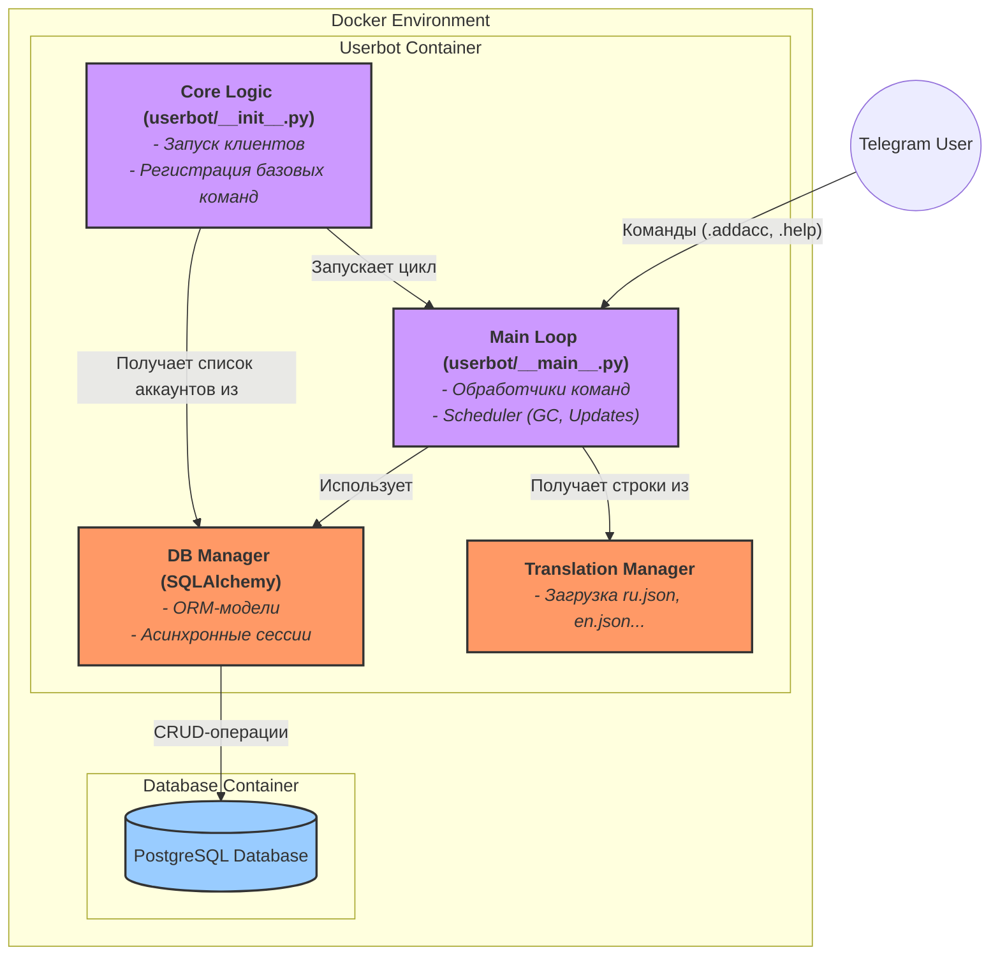

# DeBot | Модульный Telegram Userbot

**DeBot** — это продвинутый, безопасный и гибкий модульный пользовательский бот для Telegram, построенный на Python. Он спроектирован для одновременного управления несколькими аккаунтами, каждый со своими настройками, модулями и сессиями, с упором на безопасность и простоту расширения.

## Ключевые Особенности

-   **🚀 Параллельный Мультиаккаунтинг:** Автоматический запуск и управление всеми активными аккаунтами, хранящимися в базе данных. Добавляйте, удаляйте и переключайте аккаунты "на лету" через Telegram.
-   **🛡️ Модель Безопасности:** Все чувствительные данные (API ключи, сессии, пароли) надежно шифруются в базе данных. Недоверенные модули запускаются в "песочнице" `ModuleClient`, которая блокирует доступ к сессии и другим опасным методам.
-   **🧩 Продвинутая Система Модулей:** Модули могут объявлять зависимости (которые устанавливаются автоматически), требовать права доступа, иметь собственные конфигурации и переводы.
-   **🌐 Полная Локализация:** Ядро и модули поддерживают многоязычность. Все ответы пользователю и логи можно перевести, создав простые JSON-файлы.
-   **🐳 Развертывание через Docker:** Проект полностью контейнеризирован и готов к развертыванию одной командой. Интерактивный скрипт настройки сам сгенерирует для вас `docker-compose.yml` и `.env` файлы.
-   **⚙️ Гибкая Конфигурация:** Управляйте всем, от интервала сборки мусора до параметров базы данных, через переменные окружения.

## Технологический Стек

-   **Язык:** Python 3.10+
-   **Библиотека Telegram:** Telethon
-   **База данных:** PostgreSQL
-   **ORM:** SQLAlchemy (асинхронный режим с `asyncpg`)
-   **Контейнеризация:** Docker, Docker Compose
-   **Планировщик задач:** APScheduler
-   **Зависимости:** `cryptography`, `python-dotenv`, `Faker` и другие.

## Архитектура

## Быстрый старт

Самый простой способ начать работу с DeBot — развернуть его с помощью готового Docker-образа. Этот метод не требует скачивания исходного кода и подходит для большинства пользователей.

➡️ **[Перейти к руководству по установке](docs/getting-started/installation.md)**
