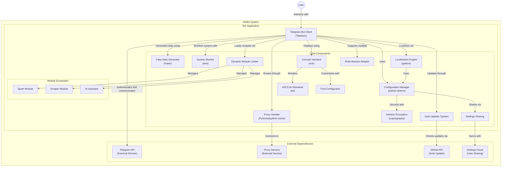

# DeBot | Лучший модульный userbot для Telegram

## Стоковые команды:
- `.addmod` - добавление модуля. Отправляется реплаем на файл с модулем, зависимости модуля обнаруживаются и устанавливаются автоматически.
- `.delmod <имя модуля>` - удаление модуля.
- `.help` - справка.
- `.about` - о юзерботе.

## Канал: [DeBot_userbot](https://t.me/DeBot_userbot)
Предложить модуль в канал или задонатить: @whynothacked
