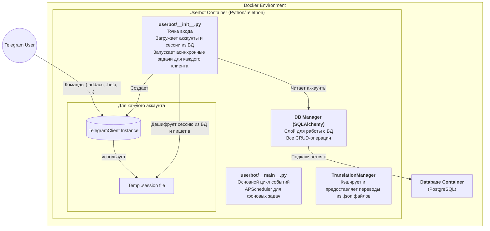

# Обзор компонентов

DeBot построен на модульной и асинхронной архитектуре, где каждый компонент выполняет свою четко определенную роль.

-   **`userbot/__init__.py` (Ядро)**: Это первая точка входа при запуске. Его задача — подключиться к базе данных, получить список всех **активных** аккаунтов (`is_enabled = True`). Для каждого аккаунта он выполняет следующие шаги:
    1.  Извлекает зашифрованный файл сессии из базы данных.
    2.  Дешифрует его.
    3.  Записывает содержимое во временный файл на диске.
    4.  Создает экземпляр стандартного `telethon.sessions.SQLiteSession`, указывая на этот временный файл.
    5.  Создает и запускает отдельную асинхронную задачу для `TelegramClient`, передавая ему эту сессию.
-   **`userbot/__main__.py` (Основной цикл)**: Этот файл содержит логику основного цикла событий и инициализирует `APScheduler` для выполнения фоновых задач (сборка мусора, автообновление).
-   **DB Manager (SQLAlchemy)**: Слой абстракции для работы с базой данных. Все функции для добавления, получения, обновления и удаления данных (аккаунтов, сессий, модулей) реализованы здесь с использованием SQLAlchemy ORM.
-   **TranslationManager**: Глобальный сервис, который отвечает за загрузку, кэширование и предоставление переведенных строк. Он обеспечивает мультиязычность во всем приложении.
-   **TelegramClient Instance**: Для каждого активного аккаунта создается свой собственный экземпляр кастомного класса `TelegramClient`, который наследуется от `telethon.TelegramClient`.
-   **Хранение сессии**: В отличие от стандартного подхода, DeBot не хранит `.session` файлы на диске постоянно. Весь SQLite файл сессии хранится в базе данных PostgreSQL в зашифрованном виде (в поле типа `BYTEA`). Это обеспечивает безопасность и централизованное хранение.
