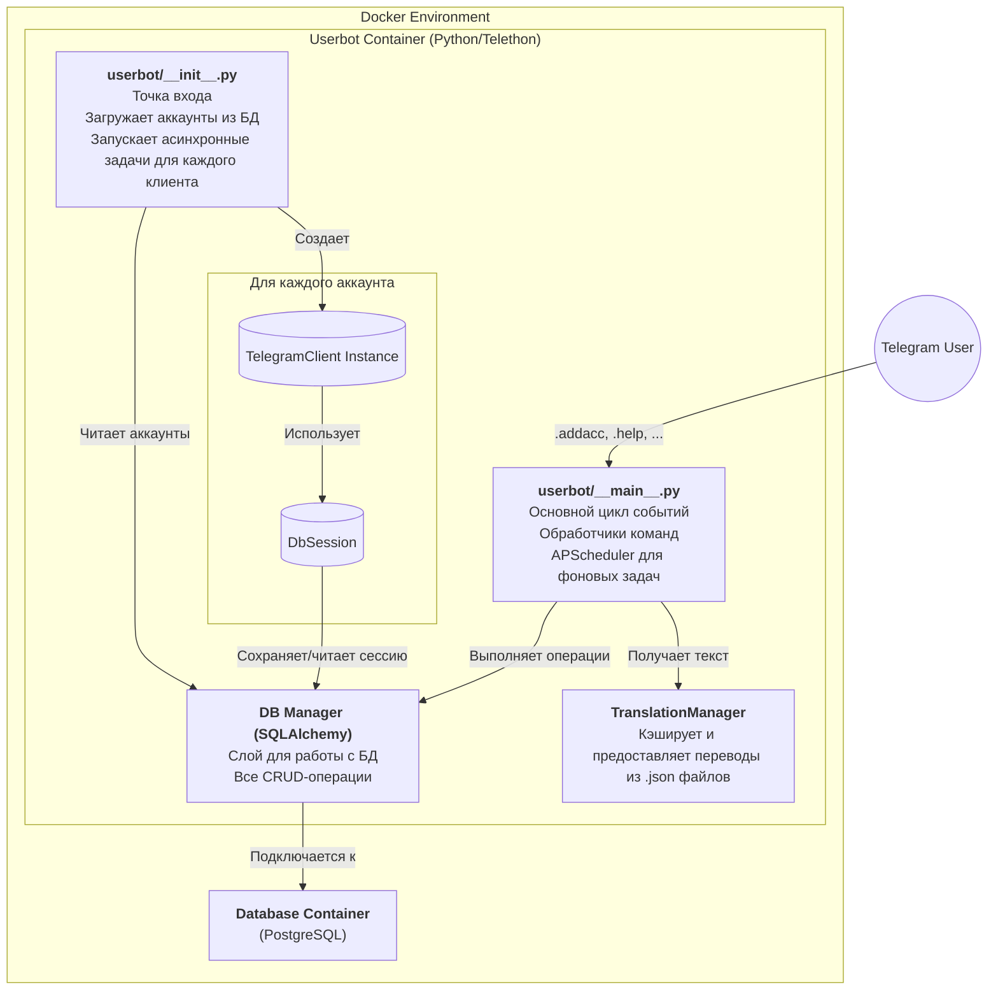

# Обзор компонентов

DeBot построен на модульной и асинхронной архитектуре, где каждый компонент выполняет свою четко определенную роль.

-   **`userbot/__init__.py` (Ядро)**: Это первая точка входа при запуске. Его задача — подключиться к базе данных, получить список всех **активных** аккаунтов (`is_enabled = True`) и создать для каждого из них отдельную асинхронную задачу по запуску клиента.
-   **`userbot/__main__.py` (Основной цикл)**: Этот файл содержит логику обработки команд, полученных от Telegram. Здесь же инициализируется и запускается `APScheduler`, который выполняет фоновые задачи (сборка мусора, автообновление).
-   **DB Manager (SQLAlchemy)**: Слой абстракции для работы с базой данных. Все функции для добавления, получения, обновления и удаления данных (аккаунтов, сессий, модулей) реализованы здесь с использованием SQLAlchemy ORM.
-   **TranslationManager**: Глобальный сервис, который отвечает за загрузку, кэширование и предоставление переведенных строк. Он обеспечивает мультиязычность во всем приложении.
-   **TelegramClient Instance**: Для каждого активного аккаунта создается свой собственный экземпляр кастомного класса `TelegramClient`, который наследуется от `telethon.TelegramClient`. Он содержит дополнительную логику, например, для работы с переводами.
-   **DbSession**: Кастомный класс сессии Telethon, который хранит данные сессии не в файле, а в базе данных PostgreSQL.
